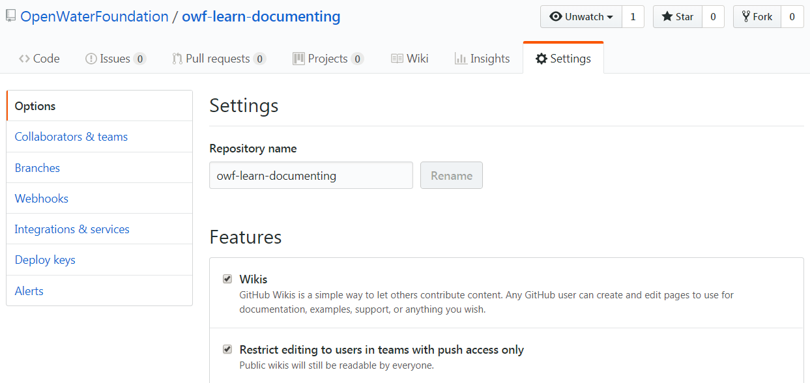
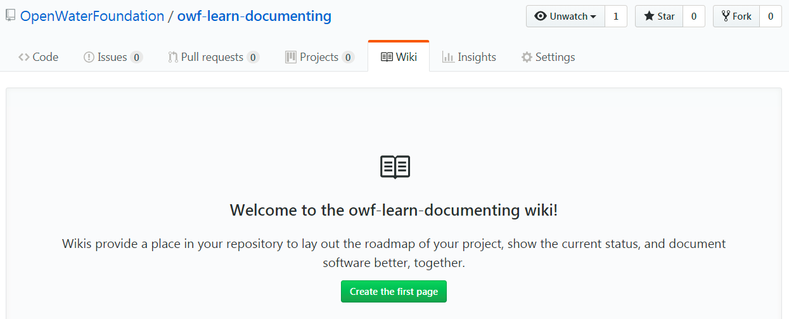
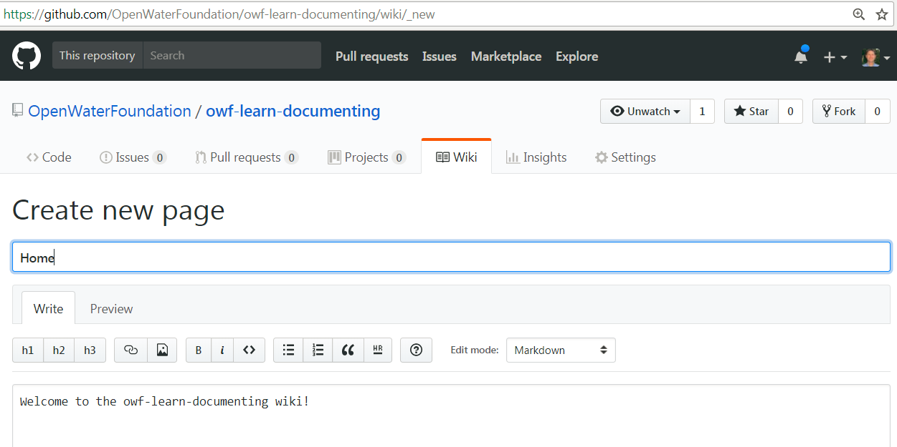
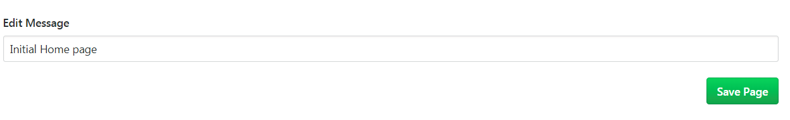
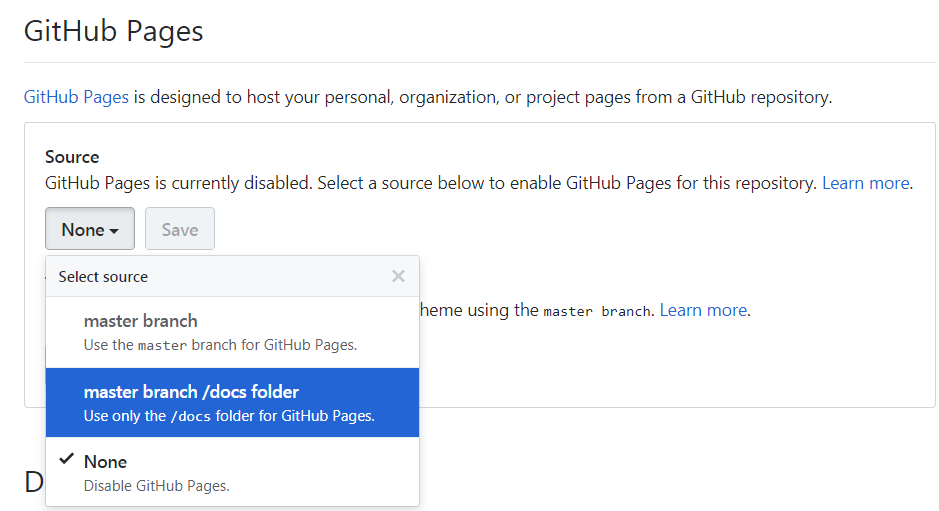
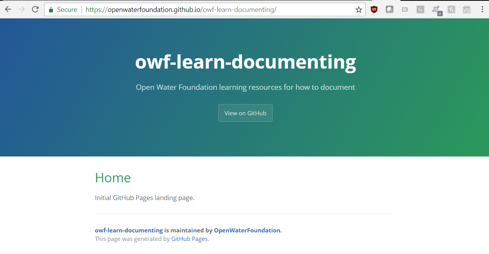

# Learn Documenting / Reference - GitHub #

GitHub provides several documentation options that leverage the features of
version control repositories and Markdown files.
GitHub repositories containing Markdown files following appropriate naming conventions
can be used to create documentation sites for software or other projects.

* [GitHub Overview](#github-overview)
	+ [Markdown Files](#markdown-files)
	+ [Repository Wiki](#repository-wiki)
	+ [GitHub Pages for Organization](#github-pages-for-organization)
	+ [GitHub Pages for User](#github-pages-for-user)
	+ [GitHub Pages for Project](#github-pages-for-project)
	+ [GitHub Gists](#github-gists)
	+ [GitBook](#gitbook)
* [Benefits of GitHub](#benefits-of-github)
* [Limitations of GitHub](#limitations-of-github)
* [When to Use GitHub](#when-to-use-github)
* [When Not to Use GitHub](#when-to-use-github)
* [Markdown Tools](#markdown-tools)

-----

## GitHub Overview ##

[GitHub](https://github.com/) provides cloud-hosted repositories for version-control of electronic files.
It is most often used to manage software code file versions, but can also be used for documentation, data, and other files.
The GitHub website can be used directly to view files in various formats (version control tools, raw view, etc.).
Git software such as
[Git for Windows](https://git-scm.com/downloads) can be used to download GitHub repositories to the desktop computer.

GitHub has leveraged repository technologies and [Markdown](ref-markdown) format files to create several options
for online documentation:

### Markdown Files ###

Markdown files can be included in a GitHub repository, as follows:

* The GitHub website will automatically convert Markdown files to HTML to display on the GitHub website.
* Any folder with `README.md` file will result in that file being formatted as HTML and displayed
when the folder is visited via the GitHub website.
* Other files with `.md` file extension, when selected via the GitHub website, will be formatted as HTML and displayed.
* A `.github/README.md` file in the repository will be used as the main repository `README.md` file even if
a `README.md` file is found in the main folder of the repository.
* See [GitHub-flavored Markdown](https://github.github.com/gfm/), which provides some extensions to general Markdown
to increase integration with GitHub features.

Consequently, Markdown files that are included in the repository provide a simple and convenient way to
record information that is specific to a folder.
Markdown files such as `README.md` should be used where appropriate to document work products,
until the point that such an approach is limiting,
such as when there is a need for a hierarchy of documents, images need to be saved, etc.
In this case, use a more complex documentation approach such as a [repository Wiki](#repository-wiki),
[Organization Page](#github-organization-page), [Project Page](#github-project-page),
or MkDocs static website that is deployed outside of the GitHub website.

### Repository Wiki ###

The [About GitHub Wikis](https://help.github.com/articles/about-github-wikis/) page says that
"every GitHub repository comes equipped with a section for hosting documentation, called a *wiki*".
A wiki is appropriate when a hierarchy of documentation files is needed.
For example, the are uses for a wiki:

* multi-page user documentation
* multi-page developer documentation
* gallery of examples
* hosting a simple website that is "good enough"

Each repository has a wiki enabled by default.  See the ***Settings*** for the repository:

Accessing the ***Wiki*** tab for the repository provides an option to start creating content:

After content is edited, it can be saved by using the ***Save Page*** button.
The text in the ***Edit Message*** field is used as the Git commit message.

Because the repository online Wiki is the tool to view the Wiki content, there is little reason to clone the wiki
repository locally and edit outside of the GitHub web page.
However, should it be necessary to do so, the wiki is maintained in a separate repository,
for example: `https://github.com/OpenWaterFoundation/owf-learn-documenting.wiki.git`
(note that the name is the same as the original repository with `.wiki` inserted).
For example, adding image files to the wiki may require local editing given that
the [online instructions](https://help.github.com/articles/adding-images-to-wikis/)
don't explain how to add an image within the wiki repository using online editor.
Using a separate repository for the wiki allows different permissions to be granted for the core
repository and the wiki repository.

GitHub repository wikis are relatively limited.
For example, they do not provide search capabilities and nice navigation features.
A better option for significant documentation such as full user and developer documentation,
is to use [Markdown with MkDocs](ref-markdown).

**This documentation option is not discussed further given its limitations.
It is an option for specific cases, such as creating a gallery of examples.**

### GitHub Pages for Organization ###

GitHub supports creating a landing page for an organization with a organizational GitHub account.

* See the [User, Organization, and Project Pages](https://help.github.com/articles/user-organization-and-project-pages/).

Only one organization page per account can be created.

**This documentation option is not discussed further given its specific purpose.**

### GitHub Pages for User ###

GitHub supports creating a landing page for a user with a personal GitHub account.

* See the [User, Organization, and Project Pages](https://help.github.com/articles/user-organization-and-project-pages/).

Only one personal page per account can be created.

**This documentation option is not discussed further given its specific purpose.**

### GitHub Pages for Project ###

A "GitHub Pages" page can be configured as a landing page for each Git repository.
This is useful for providing a more formal landing page than the repository `README.md` file,
in particular to remove the GitHub "skin" from the web page and optionally provide a public web address alias that
points to the GitHub repository GitHub Pages.
 
* See the [User, Organization, and Project Pages](https://help.github.com/articles/user-organization-and-project-pages/).
* See [Publish Your Project Documentation with GitHub Pages](https://blog.github.com/2016-08-22-publish-your-project-documentation-with-github-pages/)

There are two main ways to store the pages content:

1. Create a `/docs` folder on the `master` branch.
2. Create content on a `gh_pages` branch.

The `/docs` folder approach seems to be the most straightforward and ensures that the content is
always visible on the `master`, which will avoid confusion.
To usea GitHub Pages:

1. Create a  `/docs/index.html` file on the `master` branch of the repository.
Because GitHub won't save empty folders, an initial file must be created.
Commit the file to the repository.
2. Select the above in the repository ***Settings***. 

3. Select a theme for pages.  Start with `Cayman`, which is the default, until there is a need to change.
4. Can also select a custom domain for the site - skip for now but can specify later.
5. View the website:
	1. [https://OpenWaterFoundation.github.io/owf-learn-documenting](https://OpenWaterFoundation.github.io/owf-learn-documenting) 
	

GitHub pages provide a way to host static websites for a product.
However, significant content editing may be required to achieve a professional-looking website,
for example using the [Jeckyll](https://jekyllrb.com/) features built-in to GitHub Pages.
An alternate static website generation tool may be used, such as [MkDocs](ref-mkdocs).
GitHub pages hosts the static website free for open source projects or will have to be paid for via the personal or organizational account.

**GitHub Pages, especially with Jeckyll, are an option for complex static websites if other options such as MkDocs are not used.**

### GitHub Gists ###

[GitHub Gists](https://help.github.com/articles/about-gists/) are repositories that are intended
to share files or serve as points of discussion.
A major limitation is that gists are only for files and cannot save content that exists in folder.
For example, a Gist would not be used for an ongoing software development project.
Gist is similar to [pastebin.com](https://pastebin.com/).

**This documentation option is not discussed further given its limitations.**

### GitBook ###

[GitBook](https://www.gitbook.com/) is a third-party company that leverages GitHub to publish books
via collaboration through GitHub.
It is mentioned here only as another documentation alternative.

**This documentation option is not discussed further given its specific focus.**

## Benefits of GitHub ##

1. Markdown files are simple text files and can be edited with a text editor.
2. Markdown files can often be understood when edited with a text editor, even without formatting output.
Therefore, Markdown files are similar to README text files.
3. Markdown can be converted to HTML and therefore can replace more complex HTML in many applications.
For example, Mkdocs source content is written in Markdown and gets converted to static HTML websites.
4. Many tools now recognize Markdown and are migrating to its use as a preferred or default option.
For example, Markdown files in a GitHub repository will automatically be formatted and displayed.
5. Markdown files are simple and people require little training to attain proficiency using Markdown.
6. Versions of Markdown files can be easily tracked in a version control system such as Git.
Differences between versions can be easily pinpointed,
compared to binary files such as Word and PDF that are essentially "blobs" of encoded text.
7. Because Markdown is an open standard, there are many open source and commercial software tools.

## Limitations of GitHub ##

1. Formatting in Markdown files is simple by design and may not meet all formatting needs.
Complex formatting such as equations requires additional tools and/or formatting tricks
such as saving to an image or embedding raw HTML into the Markdown.
This is a topic of ongoing discussion.
2. People may not be familiar with Markdown or related software tools.
3. Although Markdown files can be emailed, they are better suited for online collaborative platforms.
This limitation may not be as much of a factor in circles where people are comfortable with Markdown.
4. Markdown editors that show the formatted text parallel to the input may not be available.
Such tools are becoming more common and therefore this limitation will diminish over time.

## When to Use GitHub ##

The following are recommendations for when to use Markdown:

1. If the overall environment favors Markdown, such as Git repositories.
2. When creating navigable, interactive static websites such as software manuals - MkDocs is a good option.
3. When an upgrade to standard text README files is appropriate,
in particular when files can be moved to a version control system such as Git/GitHub.

## When Not to Use GitHub ##

1. When a traditional memo/report document is needed - Word/PDF are probably better.

## GitHub Tools ##

* Editors:
	+ [Atom](https://atom.io/)
	+ [MarkdownPad](http://markdownpad.com/)
* Static website generator:
	+ [MkDocs](http://www.mkdocs.org/)
